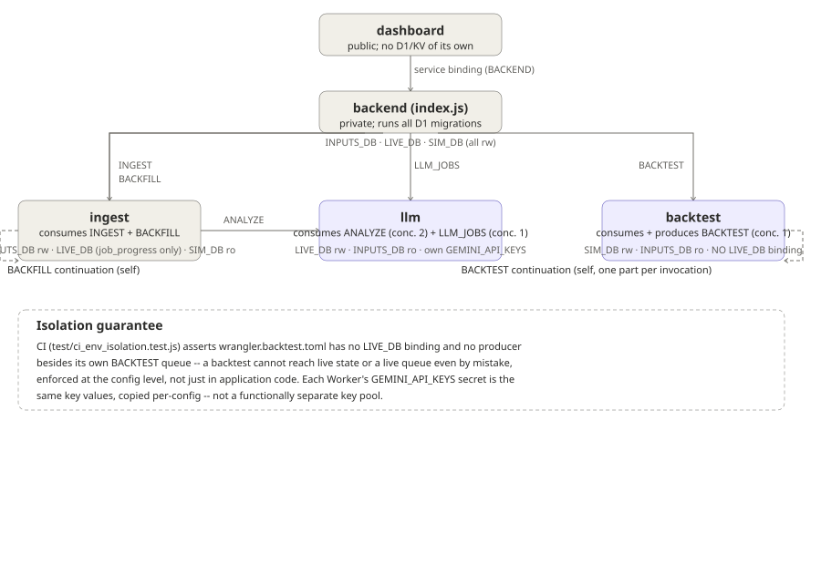

# Pipeline stage diagrams

Reference diagrams for `runPipelineForTicker` (one ticker, one news item), covering the full stage sequence in `src/graph/pipeline.js`.

## Ingest through debate

1. **Ingest news item** -- upstream normalization happens in `ingestion/ingest.js#collectNewsItems`, which feeds `newsItem` into the pipeline.
2. Stage `analyzed`: `Promise.all` of three parallel analysts -- `runNewsEventAnalyst` (`agents/analysts/newsEventAnalyst.js`), `runSentimentAnalyst` (`agents/analysts/sentimentAnalyst.js`), `runTechnicalAnalyst` (`agents/analysts/technicalAnalyst.js`, needs price bars via `getPriceBarsAsOf`, skipped if none).
3. Stage `debated`: a loop (`do/while shouldContinueDebate`, `graph/conditional_logic.js`, `config.maxDebateRounds` default 1) of `Promise.all(runBullResearcher, runBearResearcher)` (`agents/researchers/bull.js`, `bear.js`) followed by `runResearchManager` (`agents/managers/research_manager.js`), the judge, which produces the verdict.

## Verdict through commit

4. Stage `traded`: `runTrader` (`agents/trader/trader.js`) turns the verdict into a thesis. Never sizes.
5. Stage `risk_checked`: `evaluateRisk` (`agents/risk_mgmt/risk.js`) -- deterministic, no LLM, sets sizing/stop-loss/take-profit.
6. Stage `portfolio_checked`: `evaluatePortfolio` (`agents/managers/portfolio_manager.js`) -- deterministic, no LLM, portfolio-wide risk ceiling go/no-go. If approved: `store.commitThesis` (atomic open/replace), plus `settlePositionOutcome` (`graph/settle.js`, a reflection call) if replacing an existing position.

## Worker, queue and D1 topology

Five Workers, each with its own `wrangler.*.toml`: `dashboard` (public, no D1/KV, reaches everything through a service binding to `backend`), `backend` (`index.js`, private, owns migrations for all three D1s, produces every queue), `ingest`, `llm`, and `backtest`. Queues: `INGEST`/`BACKFILL` (backend produces, ingest consumes; ingest also self-produces `BACKFILL` continuations), `ANALYZE` (ingest produces, llm consumes), `LLM_JOBS` (backend produces `exit_check`/legacy `backtest` messages, llm consumes), `BACKTEST` (backend produces the first message, backtest Worker both consumes and self-produces continuation parts). `backtest` deliberately has no `LIVE_DB` binding and no queue producer besides its own `BACKTEST` queue -- enforced by `test/ci_env_isolation.test.js`, not just convention.

## Notes

- Every stage is checkpointed (`graph/checkpointer.js`), so a crash resumes from the next stage instead of re-spending LLM calls.
- LLM-backed stages (purple): the three analysts, bull/bear researchers, research manager, trader. These are the calls that collide with the free-tier Gemini RPM limit (see Next To-Dos item on Gemini batching).
- Deterministic stages (gray): risk check, portfolio check. No LLM involvement, no rate-limit exposure.
- Conditional LLM call, easy to miss: `settlePositionOutcome` (`graph/settle.js`) only fires on a position close/replace, but when it does it calls `graph/reflection.js#closeTheLoop` -> `agents/utils/memory.js#recordAndReflect` -> `callStructured` (quick model). Same Gemini key/RPM budget as the stages above -- not shown in the two diagram images above since it isn't part of the main per-item stage sequence, but worth counting when sizing the batching-vs-more-keys decision.
- Gating, upstream of everything shown here: `src/llm-worker.js#queue` checks `flags.trading || flags.llm` once per batch, BEFORE dispatch. Either flag paused means the `analyze` message is ack'd without ever calling `runPipelineForTicker` -- none of the stages above run, and the item is never analyzed later (no re-check on unpause). The same combined check also gates `exit_check`, not just `trading` alone.
- Full manual verification of the codebase map (sections 1-7 against the original delegate_agent scan) is now complete: top-level structure, all 5 Worker entry points, every agent file under `src/agents/`, all D1 migrations across `migrations/{inputs,state,sim}/`, the queue/binding topology above, `test/helpers/sqlite_d1.js` (a real-SQL, node:sqlite-backed D1 stand-in used by tests), and `src/login.js`/`src/schemas/index.js`. One naming gotcha found in `migrations/inputs/0003_vendor_rate_limits.sql`: the file creates a table called `vendor_request_counters`, not `vendor_rate_limits`.
